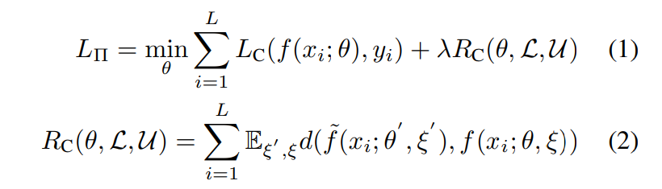
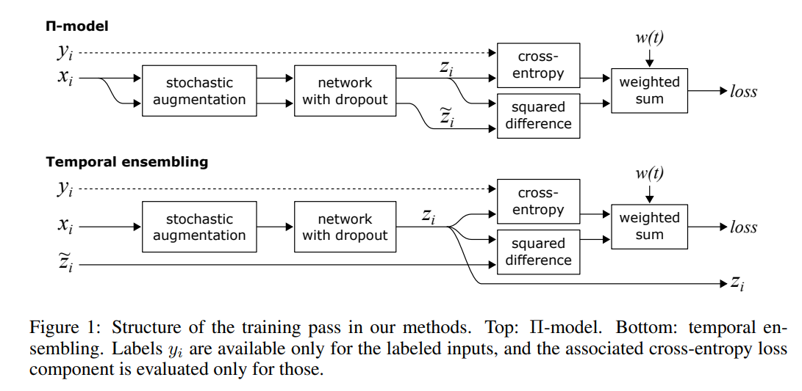
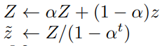
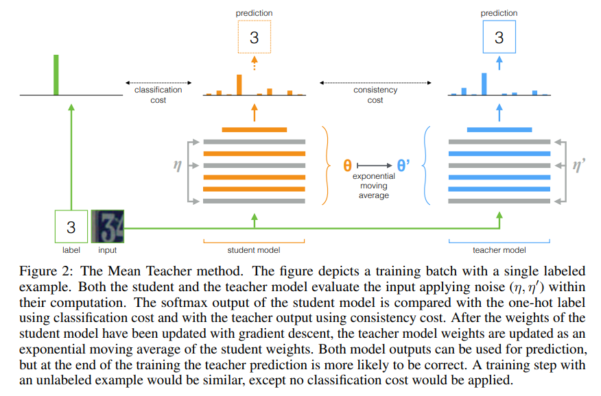
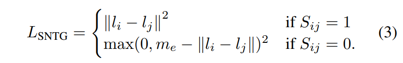
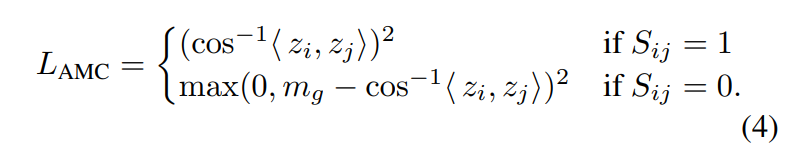
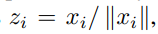

# Orthogonal Sphere Regularization

## 論文

- [Role of Orthogonality Constraints in Improving Properties of Deep Networks for Image Classification (2020-09-22)](https://arxiv.org/abs/2009.10762)

## 概要

- 最後のglobal average poolingをk個に等分割して、それぞれの内積が0に近いくなるような正則化項。
- k=16で実験している。
- これで背景の変化に頑健になるようだが、ロジックまではよくわかってない。
- 論文内では、ΠモデルとSNTGとAMCが従来法として記載されていて、組み合わせて使用されてる。

## 従来法

### Πモデル

- 以下の論文に、Temporal Ensemblingとの比較として上がっている。
  - [Temporal Ensembling for Semi-Supervised Learning (2016-10-07)](https://arxiv.org/abs/1610.02242)

- L_Cは普通のCEなど。R_Cがラベルのない学習データを活用するための正則化項となる
- f~はNoisy teacher modelで、ランダムな摂動ξ~を受ける
- 同様にfは摂動ξを受ける
- dは2つの予測される確率分布間のdivergenceである。
- これにより、摂動に頑健かどうかを示すロスとして機能している。
- より具体的には
  - 摂動ξ'を加えたf~やらθ'の出力と、これとまた別の摂動ξを加えた場合に、２つのKL divergenceなどが大きくならないように学習する。
  - 摂動は、入力のaugmentationやdropoutなどのネットワークの編集などを含んでいるみたい。

### Temporal Emsembling

- 論文は前節と同じ

- Temporal emsemblingはzを指数平滑化する。
- また、立ち上がりを補正するため、学習の初期段階では1-α^tで除算する。

### Mean Teacher

- 論文
  - [Mean teachers are better role models: Weight-averaged consistency targets improve semi-supervised deep learning results (2017-03-06)](https://aps.arxiv.org/abs/1703.01780)

- z, z~計算時のパラメータを同じものを使わずに、studentとteacherにわけてそれぞれでdivergenceを計算する。
- teacherのパラメータは、studentとは異なり、studentの指数平滑フィルタで更新する。

### SNTG: Smooth Neighbors on Teacher Graphs

- 論文
  - [Smooth Neighbors on Teacher Graphs for Semi-supervised Learning (2017-11-01)](https://arxiv.org/abs/1711.00258)

- ΠモデルやMean Teacherは、その推論結果の予測ラベルが異なる場合にも、差を縮めようとするのでよくない。
- そこで同じラベルの場合は、低次元特徴量 l_i, l_jのユークリッド距離が小さくなるよう制御し、
- そこで異なるラベルの場合は、低次元特徴量 l_i, l_jのユークリッド距離が大きくよう制御する。（ただし上限はm_eで制御する）

### AMC: Angular Margin Contrastive

- 論文
  - [AMC-Loss: Angular Margin Contrastive Loss for Improved Explainability in Image Classification (2020-04-21)](https://arxiv.org/abs/2004.09805)

- SNTGのユークリッド距離を、geodesic metric defined for unit-normalized latent representationsにした。
- geodesic metricは測地線と訳され、曲面上の距離っぽい？unit-normalized latent representationsはよくわからない。
- Grad-CAMの解釈なども最適になるらしい。
- z_i, z_jは最終層出力かな？　⇒　違うみたい。これがunit-normalized latent representationsのようだ。 

unit-normalized latent representationsは以下の正規化で、x_iは一番深い層の特徴量である。

