# YOLOv7

- 題名: YOLOv7: Trainable bag-of-freebies sets new state-of-the-art for real-time object detectors
- 論文: [https://arxiv.org/abs/2207.02696](https://arxiv.org/abs/2207.02696)

## Summary

- Transformerベースの物体検出器を上回る性能を達成した(AP:55%以上)。
- その他の物体検出器(Scaled-YOLOv4, YOLOv5, YOLOR, YOLOXを含む)を凌駕しています。
- YOLOv7はImageNetを使用せず、MS COCOデータセットのみで学習されます。

## 1. Introduction

> - アーキテクチャの最適化に加え、本提案手法では学習プロセスの最適化にも着目する。
> - 本論文では、物体検出の精度を向上させるための学習コストを強化しつつ、推論コストを増加させない最適化モジュールと最適化手法に注目する。
> - 我々は、提案するモジュールと最適化手法をtrainable bag-of-freebiesと呼ぶ。

- スタンスはYOLOv4に近い内容

> - 近年の物体検出においては以下が重要なトピックとなっている。
>   - モデルの再パラメータ化 [13, 12, 29] 
>   - 動的ラベル割り当て [20, 17, 42] 
> - これらの新しいコンセプトが提案された後、主に物体検出器の学習において多くの新しい問題が発生するようになった。
> - 本論文では、我々が発見した新たな課題のいくつかを紹介し、それに対する効果的な方法を考案する。

> - モデルの再パラメータ化 [13, 12, 29] 
>   - 勾配伝搬路の概念を用いて、異なるネットワークの層に適用可能なモデルの再パラメータ化戦略を分析し、計画的な再パラメータ化モデルを提案する。

- re-parameterizationは以下に書いてありそう。
  - Diverse Branch Block: Building a Convolution as an Inception-like Unit (CVPR 2021)
    - [https://arxiv.org/abs/2103.13425](https://arxiv.org/abs/2103.13425)
  - Online Convolutional Re-parameterization (CVPR 2022)
    - [https://arxiv.org/pdf/2204.00826](https://arxiv.org/pdf/2204.00826)
  - 概要としては、学習時と推論時の構成が異なるような手法。
  - 複雑なトポロジーで性能向上を学習させたのちに、等価な単一の線形レイヤに圧縮する。
  - これらは通常、最終的にはVGGやResNetのようのなシンプルなアーキテクチャに圧縮される。

> - 動的ラベル割り当て [20, 17, 42] 
>   - 複数の出力層を持つモデルの学習において新たな課題が発生することが分かった。
>   - つまり「異なる枝の出力に対して、どのように動的な目標を割り当てるか」である。
>   - この問題に対して、我々はcoarse-to-fine lead guided label assignmentと呼ばれる新しいラベル割り当て方法を提案する。

- ラベル割り当てはYOLOXにもでてきたので分かる。

> - 本論文の貢献は以下のようにまとめられる。
>   - 我々は、リアルタイム物体検出が推論コストを増加させることなく検出精度を大幅に向上させることができるように、bag-of-freebies methodsを設計する。
>   - 物体検出手法の進化に伴い、再パラメータ化したモジュールが元のモジュールをどのように置き換えるのか、動的なラベル割り当て戦略が異なる出力層にどのように割り当てるのか、という2つの新たな課題が発見された。また、これらの問題から生じる困難さを解決するための手法も提案する。
>   - リアルタイム物体検出において、パラメータと計算量を有効に活用できる「拡張」「複合スケーリング」手法を提案する。
>   - これらの結果、本提案方式は、最先端のリアルタイム物体検出器の約40%のパラメータと約50%の計算量を効果的に削減し、より高速な推論とより高い検出精度を実現することができました。

## 2. Related works

### 2.1 Real-time object detectors

> - 現在、最先端のリアルタイム物体検出器は、主に YOLO [61, 62, 63] と FCOS [76, 77] に基づいている。
> - 最先端のリアルタイム物体検出器になるためには、通常以下が必要。
>   - （1）より高速で強力なネットワークアーキテクチャ
>   - （2） より効果的な特徴統合法 [22, 97, 37, 74, 59, 30, 9, 45] 
>   - （3）より正確な検出法 [76, 77, 69] 
>   - （4）より頑健な損失関数 [96, 64, 6, 56, 95, 57] 
>   - （5）より効率の良いラベル付与法 [99, 20, 17, 82, 42] 
>   - （6）より効率の良い学習方法などが必要とされます。
> - 本論文では、上記の(4)、(5)、(6)に関連する最先端手法から導かれる課題に対して、新たに学習可能なBag of Freebies手法を設計する。

### 2.2 Model re-parameterization

> - re-parameterizationは推論段階で複数の計算モジュールを1つに統合するものである。
> - モデル再パラメータ化手法はアンサンブル手法とみなすことができる。
>   - モジュールレベルアンサンブルとモデルレベルアンサンブルの2つに分類することができる。
> - モデルレベルのre-parameterizationには、2つの一般的な手法がある。
>   - 異なる学習データを用いて複数の同一のモデルを学習させ、複数の学習済みモデルの重みを平均化する方法である。
>   - もう一つは、異なる反復回数のモデルの重みの加重平均を行う方法である。
> - モジュールレベルの再パラメータ化は、最近、より人気のある研究課題である。
>   - 学習時にモジュールを複数の同一または異なるモジュール分岐に分割
>   - 推論時に複数の分岐したモジュールを完全に等価なモジュールに統合する。
>   - しかし、提案されたすべての再パラメータ化モジュールが、異なるアーキテクチャに完全に適用できるわけではありません。
>   - そこで、我々は新たな再パラメータ化モジュールを開発し、様々なアーキテクチャに適用できるような戦略を考案しました。

### 2.3 Model Rescaling

> - モデルのスケーリングは、既に設計されたモデルを拡大または縮小して、異なるコンピューティングデバイスに適合させる方法である。
> - モデルのスケーリング方法は、通常、解像度（入力画像のサイズ）、深さ（レイヤー数）、幅（チャンネル数）、ステージ（特徴ピラミッドの数）などの異なるスケーリングファクターを使用して、ネットワークパラメータの量、計算、推論速度、および精度について良いトレードオフを達成するようにする。
> - ネットワークアーキテクチャ探索（NAS）は、一般的に使用されているモデルスケーリング手法の一つである。
> - NASは、あまり複雑なルールを定義することなく、探索空間から自動的に適切なスケーリングファクタを探索することができる。
> - NASの欠点は、モデルのスケーリングファクタの探索を完了するために、非常に高価な計算を必要とすることである。
> - [15]では、スケーリングファクターとパラメータや演算量の関係を分析し、いくつかのルールを直接推定することで、モデルのスケーリングに必要なスケーリングファクターを得ようとしている。
> - 文献を調べてみると、ほとんどのモデルスケーリング手法は、個々のスケーリングファクタを独立に解析しており、複合スケーリングカテゴリの手法もスケーリングファクタを独立に最適化していることがわかった。
> - この理由は、一般的なNASアーキテクチャの多くは、あまり相関のないスケーリングファクタを扱っているためです。
> - DenseNet [32]やVoVNet [39]などの連結ベースのモデルはすべて、そのようなモデルの深さがスケーリングされると、いくつかの層の入力幅を変更することが観察された。
> - 提案アーキテクチャは連結ベースであるため、このモデルのために新しい複合スケーリング方法を設計する必要がある。

## 3. Architecture

### 3.1 Extended efficient layer aggregation networks

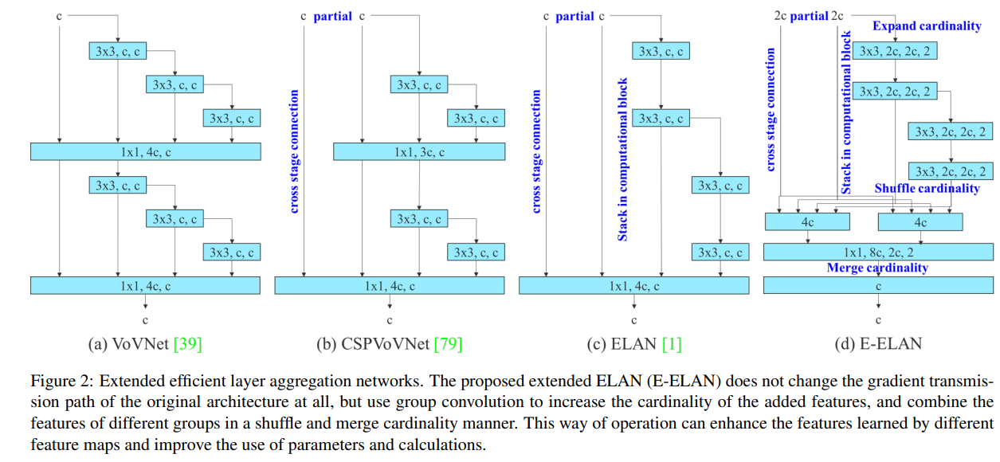

> - VoVNet

- 論文としては以下を参照している。
  - An Energy and GPU-Computation Efficient Backbone Network for Real-Time Object Detection
    - [https://arxiv.org/abs/1904.09730](https://arxiv.org/abs/1904.09730)
  - 解説
    - [【論文読み・実装】VoVNet（理論編） - Qiita](https://qiita.com/woodyZootopia/items/db6e85de34eab5247478)
  - DenseNetが手前のconvの出力を現出力にconcatenateしていくがが、VoVNetは最後の出力のみでconcatenateする。
> - CSPVoVNet
>   - VoVNet[39]を変形した設計である。
>   - CSPVoVNet[79]のアーキテクチャでは、基本的な設計上の留意点に加え、異なる層の重みがより多様な特徴を学習できるよう、勾配経路の分析も行っている。
>   - 上記の勾配分析アプローチは、推論をより速く、より正確に行うことができる。

- Scaled-YOLOv4で提案されている。（しかし見てもあんまりわからなかった）

> - ELAN
>   - ELAN[1]では、"いかに効率的なネットワークを設計 するか？"という設計戦略を考えている。
>   - 彼らは、最短最長の勾配経路を制御することで、より深いネットワークが効率的に学習し、収束することができるとした。
>   - これは出所がanonymousになっており、よくわからない論文。

- 本論文のベースになっているものの、出自がよくわからない。
- issueでは公開されてない論文がありそうな雰囲気がある。続報が待たれるところ。
  - [https://github.com/WongKinYiu/yolov7/issues/17](https://github.com/WongKinYiu/yolov7/issues/17)

> - Extended-ELAN（E-ELAN）
>   - 本論文の提案手法。勾配路の長さや計算ブロックの積層数にかかわらず、安定した状態に達している。
>   - これ以上の計算ブロックを無制限に積み重ねると、この安定状態が破壊され、パラメータ利用率が低下する可能性があります。
>   - 提案するE-ELANは、expand, shuffle, merge cardinalityを用いることで、元の勾配経路を破壊することなく、ネットワークの学習能力を継続的に向上させる能力を実現することが可能である。
>   - アーキテクチャの面では、E-ELANは計算ブロックのアーキテクチャを変更するだけで、遷移層のアーキテクチャは全く変更しない。
>   - 我々の戦略は、グループ畳み込みを使って、計算ブロックのチャンネルとカーディナリティを拡張することである。
>   - 一つの計算層のすべての計算ブロックに同じグループパラメータとチャネル乗数を適用する。
>   - そして、各計算ブロックが計算した特徴マップを、設定したグループパラメータgに従ってg個のグループにシャッフルし、それらを連結する。
>   - このとき、各グループの特徴マップのチャンネル数は、元のアーキテクチャのチャンネル数と同じになる。
>   - 最後に、gグループの特徴マップを追加して、マージカーディナリティを実行します。
>   - E-ELANは、元のELANの設計アーキテクチャを維持するだけでなく、より多様な特徴を学習するために、異なるグループの計算ブロックを誘導することも可能です。

- 記号の意味も説明がないため、理論はちょっと理解できない。
- コードとしては、`yolov7-e6e.yaml`のbackbone部分に登場していそうで、この図よりもう一つcomputation blockが深くなっている。
  - issueでも情報源や実装場所について問い合わせが来ている。
    - [https://github.com/WongKinYiu/yolov7/issues/17](https://github.com/WongKinYiu/yolov7/issues/17)
- Group Convolutionを使うような記載があるが、コードには登場していない。
- 図中の記号の意味もよくわからない。（特に末尾の,2はなんだろ？？実装上はstride=1だし。。。）
- Merge cardinalityも、コード上は単純にaddなので、図とは厳密には異なる。
- DownCの部分は少し特徴的で、stride=2のconvとmaxpoolingをconcatして作っている。（これは過去の時点でそうだったのかも？）
- DownCもすべてに共通ではなく、d6, e6, e6eのみに存在しており、工夫の一つかもしれない。

### 3.2. Model scaling for concatenation-based models

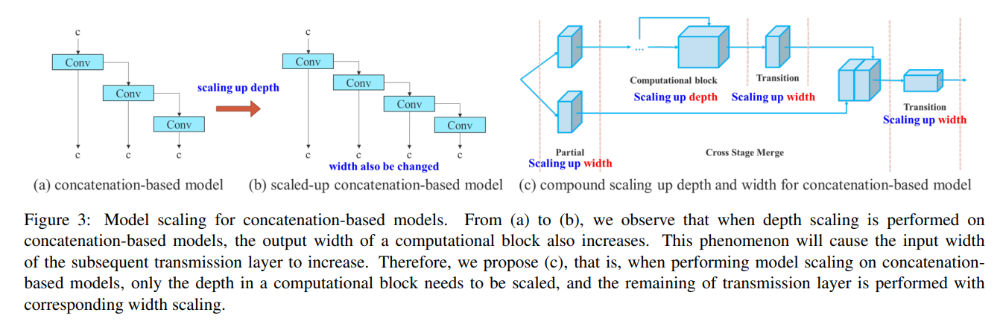

- チャネルをconcatenateするモデルは、深さを増すことでチャンネル数が増えるため、スケールファクターを同時に考慮する必要がある。
- そのため、深さのファクターは、(c)のようにComputation Blockでのみを考慮することで独立に扱えるようにした。

## 4. Trainable bag-of-freebies

### 4.1. Planned re-parameterized convolution

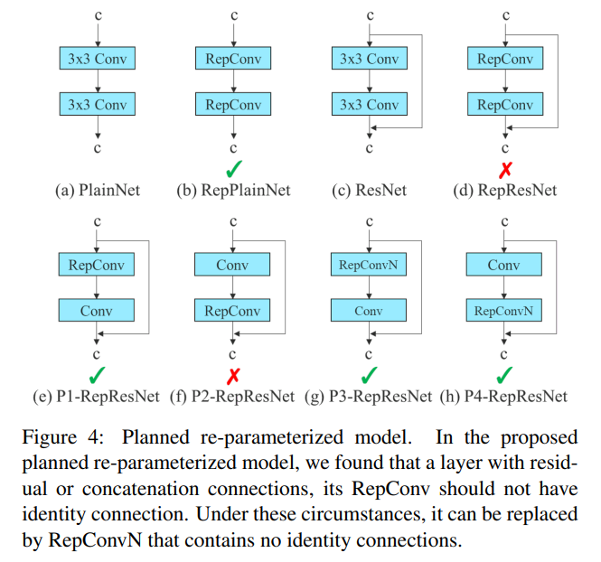

> - ResNetやDenseNetに適用可能なre-parameterized convolutionを提案
> - 我々は、勾配流伝播路を用いて、再パラメータ化畳み込みがどのように異なるネットワークと組み合わされるべきかを分析した。
> - また、それに応じて、再パラメータ化された畳み込みを設計した。
> - RepConvは、3×3畳み込み、1×1畳み込み、同一性接続を1つの畳み込み層で実際に組み合わせている。
> - RepConvと異なるアーキテクチャの組み合わせとその性能を分析した結果、RepConvのアイデンティティ接続はResNetの残差とDenseNetの連結を破壊し、異なる特徴マップに対してより多様な勾配を与えることが分かった。
> - 以上の理由から、我々は、identity connectionを持たないRepConv（RepConvN）を用いて、再パラメータ化畳み込みのアーキテクチャを設計する予定である。
> - 私たちの考えでは、残差や連結を持つ畳み込み層が再パラメータ化畳み込みに置き換わるとき、identity connectionがないことが望ましいと考える。
> - 図4は、我々が考案した「再パラメータ化畳み込み」をPlainNetとResNetに適用した例である。残差モデルと連結モデルにおける完全な再パラメータ化畳み込み実験については、アブレーションで紹介する予定である。

- 実コード上は、RepConvが`yolov7.yaml`に登場しており、他のconfigでは使用されていない。
- また、`yolov7.yaml`でもneck部の最終段のconvでのみ使用されている。
- 元論文をみないとコードレベルで理解するのは難しそう。
  - [https://arxiv.org/abs/2101.03697](https://arxiv.org/abs/2101.03697)
  - この図が全てかな。

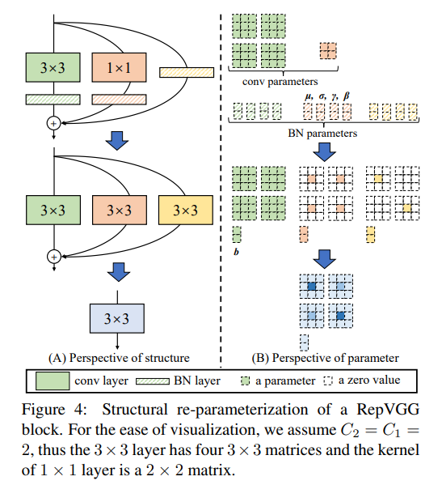

- bnは、Wの乗数とbiasにまとめることができる。
- また、identity connectionは、0を埋めれば、conv3x3に変換できる。
- 最終的にすべてのconnectionをconv3x3 + biasにまとめられるため、それらをそれぞれ加算して等価表現にすることができる。

- この論文としては、concatenateベースの場合、どの部分にre-parameterizationを適用すれば良いのかを検討した程度と言える。
- そしてその効果は、Ablation studyを見る限り、あまり効果がなさそう。まあre-parameterization自体は高速化が目的なので問題ないのかも。

### 4.2. Coarse for auxiliary and fine for lead loss

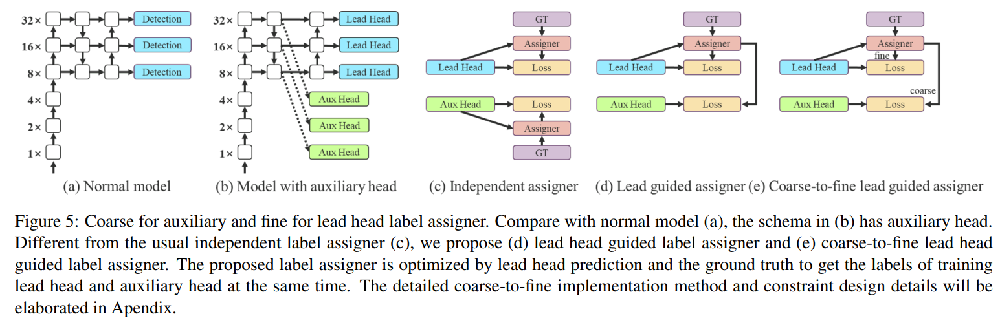

> - Deep supervision [38]は、ディープネットワークを学習する際によく使われる手法である。
> - その主なコンセプトは、ネットワークの中間層に余分な補助ヘッドを追加し、アシスタントロスをガイドとした浅いネットワークの重みを追加することである。
> - ResNet [26]やDenseNet [32]のような通常よく収束するアーキテクチャであっても、Deep supervision は多くのタスクでモデルの性能を大幅に向上させることができる。
> - (a) と (b) はそれぞれ、物体検出器アーキテクチャを「ディープスーパービジョンなし」と「ディープスーパービジョンあり」で示したものである。
> - 本論文では、最終出力を担当するヘッドをリードヘッドと呼び、学習を補助するために用いるヘッドを補助ヘッドと呼ぶことにする。

- Deep supervisionは、以下の論文で提案されている古くからある手法。(この論文？という感じ。後述のGoogLeNet見た方が良い。)
  - [Deeply-Supervised Nets (2014-09-18)](https://arxiv.org/abs/1409.5185)
- GoogLeNetアーキテクチャでも使用されている。
  - [Going Deeper with Convolutions (2014-09-17)](https://arxiv.org/abs/1409.4842)
  - [深層学習っぽい用語のメモ 〜 Auxiliary loss、Transformer-XL、axial-attention〜](https://magattaca.hatenablog.com/entry/2021/09/19/003636)
- 要するに、途中層に分類用のheadを付けて分類器にして、そのLossを補助的なロスとして使用する。

> - 次に、ラベルの割り当ての問題について述べたい。
> - 従来、ディープネットワークの学習において、ラベルの割り当てでは、直接グランドトゥルースを参照し、与えられたルールに従ってハードラベルを生成するのが一般的であった。
> - しかし、近年では、物体検出を例にとると、ネットワークが出力する予測の品質や分布を利用し、グランドトゥルースと合わせて検討し、何らかの計算や最適化手法を用いて信頼性の高いソフトラベルを生成することが多い[61, 8, 36, 99, 91, 44, 43, 90, 20, 17, 42]。
> - 例えば、YOLO[61]では、バウンディングボックス回帰の予測値のIoUと、グランドトゥルースを物体らしさのソフトラベルとして用いている。
> - 本論文では、ネットワークの予測結果とグランドトゥルースを合わせて考慮し、ソフトラベルを付与する機構を "label assigner" と呼ぶことにする。
> - Deep supervisionは、補助ヘッドやリードヘッドの状況に関わらず、対象目的に応じて学習させる必要がある。
> - ソフトラベルアサイナー関連技術の開発中に、我々は偶然にも新たな派生課題を発見した。
> - "ソフトラベルをどのように補助ヘッドとリードヘッドに割り当てるか？"である。
> - 我々の知る限り、関連する文献ではこれまでこの問題について検討されていない。
> - 現在最も普及している方法は、図5（c）に示すように、補助ヘッドとリードヘッドを分離し、それぞれの予測結果とグランドトゥルースを用いてラベル割り当てを行うというものである。
> - 本論文で提案する方法は、リードヘッドの予測によって補助ヘッドとリードヘッドの両方を誘導する新しいラベル割り当て方法である。
> - つまり、リードヘッド予測をガイダンスとして、粗い階層ラベルから細かい階層ラベルを生成し、それぞれ補助ヘッドとリードヘッドの学習に用いる。
> - 提案する2つの深層監督ラベル割り当て戦略をそれぞれ図5（d）、（e）に示す。

- 要は、ラベル割り当て戦略を使用する場合に、ソフトラベルをどう扱うかを検討したらしい。
- また同時に、ソフトラベルをどのようにauxiliary lossとlossに割り当てるかも検討した。
- 実際従来は、auxiliary lossとlossは、別々のアサイン戦略で実現されていた。
- 提案する手法は、loss側のアサイン結果を使ってauxiliary lossを計算する手法。これが(d)と思われる。
- さらに(e)は検討した手法で、auxiliary loss側は粗いソフトラベルを使用する。

> - 粗いラベルは正標本付与処理の制約を緩和してより多くのグリッドを正標題として扱えるようにして生成したものである。
> - これは、補助ヘッドの学習能力がリードヘッドほど高くないためで、学習すべき情報を失わないために、物体検出タスクでは補助ヘッドのrecallの最適化に重点を置くことにする。  

- 理由は上記の通り。

> - リードヘッドの出力に関しては、高精度な結果を高リコールな結果からフィルタリングして最終出力とすることが可能である。
> - しかし、粗いラベルの追加重みが細かいラベルのそれに近い場合、最終予測時に悪い事前分布を生成する可能性があることに注意する必要がある。
> - そこで、このような余分な粗い正のグリッドの影響を少なくするために、デコーダに制限を設け、余分な粗い正のグリッドが完全にソフトラベルを生成できないようにする。このような仕組みにより、学習過程で細かいラベルと粗いラベルの重要度を動的に調整し、最適化可能な上限値を粗いラベルよりも常に高くすることができる。
> 

- ただしこのままでは粗いラベルの悪影響が補助ヘッドにより伝わる可能性があるため、制限を設けている。
- 制限の内容はよくわからないが、auxiliary lossの重みを低下させるのかな？

### 4.3. Other trainable bag-of-freebies

> - (1) conv-bn-activation トポロジにおけるバッチ正規化。この部分は主にバッチ正規化層と畳み込み層を直接接続する。
> - この目的は、推論段階において、バッチ正規化の平均と分散を畳み込み層のバイアスと重みに統合することである。

- conv-bnの直接接続は普通の構成では？？と思う。

> - (2) YOLOR [81]の暗黙知を畳み込み特徴量に加算・乗算で結合する。YOLOR の暗黙知は、推論段階で予め計算することで、ベクトルに単純化することができる。このベクトルは、前後の畳み込み層のバイアスと重みと組み合わされる。

- ここはYOLORを読まないと分からないなぁ。

> - (3) EMAモデル。EMAはmean teacher[75]で用いられる手法であり、本システムでは純粋にEMAモデルを最終推論モデルとして用いている。

- YOLOXでも使用されていた手法。
  - [Mean teachers are better role models: Weight-averaged consistency targets improve semi-supervised deep learning results (2017-05-06)](https://arxiv.org/abs/1703.01780)

- 摂動に頑健なモデルを構築するための手法。ちょっと別にまとめてある。

## 5. Experiments

### 5.1 Experimental setup

- 以下がアーキテクチャの一覧。

|||
|:---|:---|
| YOLOv7-tiny | エッジGPU用基本モデル |
| YOLOv7 | ノーマルGPU用基本モデル | 
| YOLOv7-W6 | クラウドGPUの基本モデル |
| YOLOv7-X | YOLOv7に対してneckに通常のスタックスケーリング、モデル全体は提案する手法でdepthとwidthをスケーリングしたもの。|
| YOLOv7-E6 | YOLOv7-W6を提案手法でスケーリングしたもの１ |
| YOLOv7-D6 | YOLOv7-W6を提案手法でスケーリングしたもの２ |
| YOLOv7-E6E | YOLOv7-E6を提案手法のEELANを適用したもの | 

- 活性化関数は、tinyのみ leaky-ReLUを使用し、他のモデルについては、SiLUを使用している。

### 5.2. Baselines

- ベースラインは、YOLOv4, Scaled-YOLOv4, YOLORとしている。

### 5.3. Comparison with state-of-the-arts

- その他最新手法との比較。
- まあ参考程度に。

### 5.4. Ablation study

### 5.4.1 Proposed compound scaling method

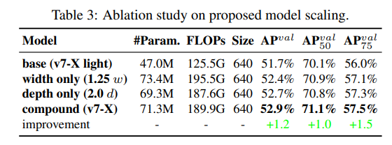

> - 表 3 は、スケールアップに様々なモデルスケーリング手法を用いた場合に得られる結果を示している。
> - その中で、我々が提案する複合的なスケーリング方法は、計算ブロックの深さを1.5倍、遷移ブロックの幅を1.25倍にスケールアップする方法である。
> - 幅だけを拡大した手法と比較すると、より少ないパラメータと計算量で、APを0.5%向上させることができる。
> - また，奥行きだけを拡大する手法と比較すると，パラメータ数を2.9%，計算量を1.2%増やすだけで，APを0.2%向上させることが可能であることがわかる．
> - 表3の結果から、我々の提案する複合的なスケーリング戦略は、パラメータと計算量をより効率的に利用できることがわかる。

- 「計算ブロックの深さを1.5倍、遷移ブロックの幅を1.25倍にスケールアップ」ということ。
- 言うほどどれも変わらないな。。。

### 5.4.2 Proposed planned re-parameterized model

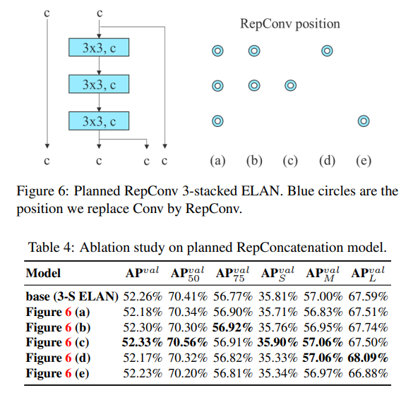

- concatenateモデルは、3-stacked-ELANを用いて検証。
- いろんな部分を置き換えているが、どれも性能に影響は小さそう。

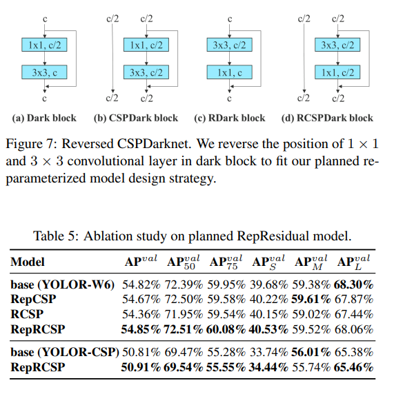

- 残差モデルは、CSPDarknetを用いて検証。
- ただし、conv3x3の場所が検証に適していないため、言えれ変えて検証している。
- なんか悪影響があったという結果が対抗としてないため、良いのか分からんね。

### 5.4.3 Proposed assistant loss for auxiliary head

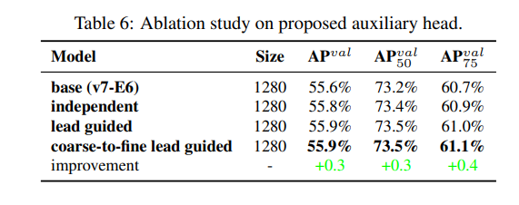

- 一定効果がありそう。

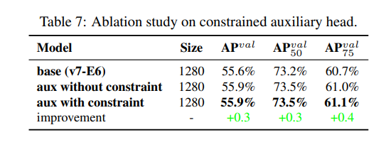

> - 表7では、提案する粗から細へのリードガイドラベル割り当て方法が補助ヘッドのデコーダに与える影響をさらに分析する。
> - すなわち、上限制約を導入した場合と導入しない場合の結果を比較した。
> - 表の数値から判断すると、オブジェクトらしさの上限をオブジェクトの中心からの距離で制約する方法の方が良い性能を達成できることがわかります。

- こちらも一定効果があり、制約については記述がある。
- 「オブジェクトらしさの上限をオブジェクトの中心からの距離で制約する方法」の部分。

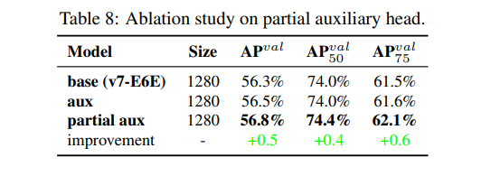

> - 提案するYOLOv7は、複数のピラミッドを用いて物体検出結果を共同予測するため、中間層のピラミッドに補助ヘッドを直接接続して学習させることができます。
> - このような学習により、次のレベルのピラミッド予測で失われる可能性のある情報を補うことができます。
> - 以上の理由により、提案するE-ELANアーキテクチャでは、部分的な補助ヘッドを設計しました。
> - このアプローチは、カーディナリティをマージする前に、特徴マップのセットの1つ後に補助ヘッドを接続するものである。
> - この接続により、新たに生成された特徴マップの重みは、補助損失により直接更新されないようにすることができる。
> - 我々のデザインは、リードヘッドの各ピラミッドが依然として異なるサイズのオブジェクトから情報を取得することを可能にする。
> - 表8は、2つの異なる方法、すなわち、粗から微へのリードガイド法と部分的な粗から微へのリードガイド法を用いて得られた結果を示している。
> - 明らかに、部分的粗微動リードガイド法の方が、補助効果が高いことがわかる。

- こちらは効果がありそう。
- merging cardinalityより前に補助ロスを付けることがポイントっぽい。

## 実装

### tiny

- tinyモデルのアーキをまとめた。図が小さくなってしまうが、大枠はpyramid構造が3回程度連続するPANet風である。

- キーとなるのは各部位の畳み込みが以下のような構成となっていることと思われる。(C5部分を抽出)

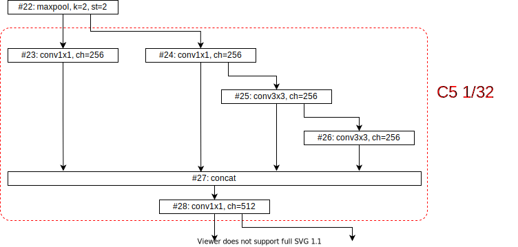

- またbackboneの最終層直後(C5の直後)に以下のようなSPPブロックが設置される。

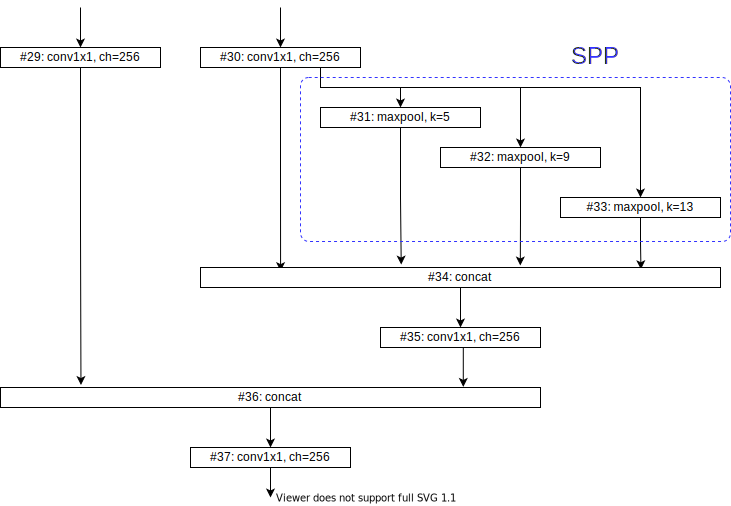

- 以降は以下のようなupsampleを処理するconv blockが接続される。


- その後、再度downsample処理をする以下のブロックが接続される


- 最終的な検出は、1/32, 1/16, 1/8解像度部分で行われる。
- head部の最終段は、通常のDetect処理となる。
- 各レイヤの活性化関数は、LeakyReLU(0.1)が使用される。

### normal

- 各ブロックは以下のような構成に変わっている。(C5部分を抽出)

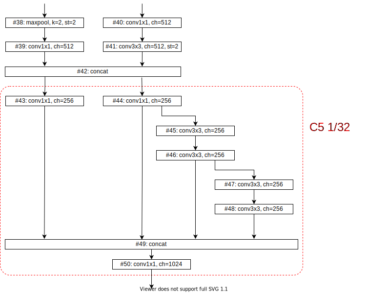

- 変わっていることとしては、右側のcomputation blockの畳み込みが深くなっていること。
- おそらくこれがELANと考えられる。
- 加えてダウンサンプリング処理がmaxpoolingと畳み込み２系統のconcatになっている点である。

- tinyのSPPブロックは、以下のようなSPPCSPCに代わっている。
- 右側のcomputing blockのcv1,cv3,cv4の部分とcv5,cv6の部分で層数が増加していることが分かる。

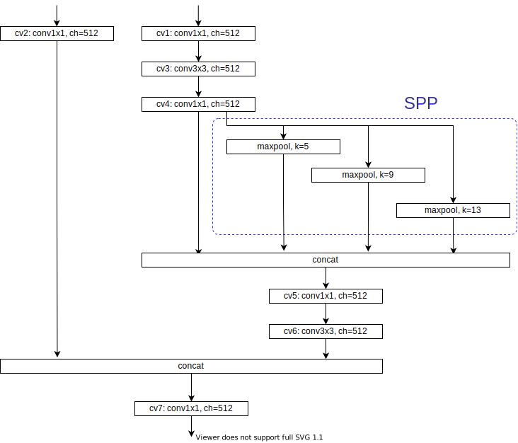

- upsample部分は、接続数が増えており6つのconcatになっている。


- その後、再度downsample処理をする以下のブロックが接続される。
- downsampleが2系統になり、computation blockが6系統になる。

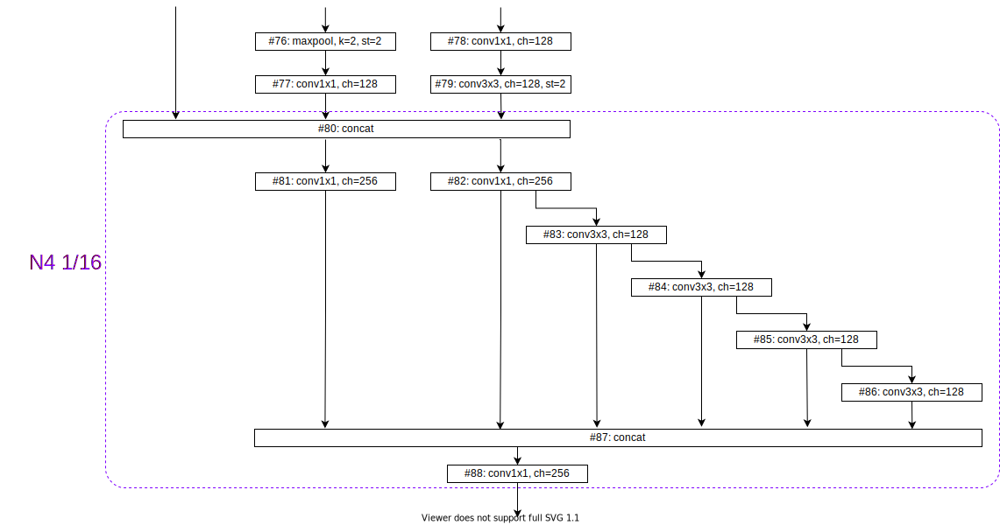

- 最終的な検出は、1/32, 1/16, 1/8解像度部分で行われる。
- 最終段の直前で、re-parameterization convがそれぞれの解像度に対して挿入される。
  - RepConvN（identityなし）ではなく、通常のRepConvに見える。
- head部の最終段は、通常のIDetect処理となり、YOLORのImplicit処理が入る。

### w6

- 先頭のdownsampleがReOrgという処理となっている。
- ReOrgはYOLORでも登場しているが、縦横1つとばしにpixelを取得して4倍のチャンネルを作成し、かつdownsampleする手法である。

- それ以降のdownsampleは通常のconv3x3で実行され、normalのような2系統ではなくなっている。
  - おそらく2系統の方が高速なのであろうなので、妥当な気がする。
- ELAN構成は、normalと変わりがないが、解像度が4種類に増加している（1/64が追加されている）。

- 最終段はIAuxDetectとなっており、Auxは一つ手前のpyramid(updample後の部分)に接続される。

### x

- normalの拡張。
- ELANが4->5系統に増加しており、ノード数も多少増加している。
- ただし、upsampleや2回目のdownsampleは、6系統から5系統に変化しており、1回目のdownsampleのELANと同じ構成で統一されている。

### e6,d6

- w6の拡張
- 1回目のELANはxと同様に4->5系統に増加しており、ノード数も増加。
- ただし、upsampleや2回目のdownsampleは、xとは異なり、全系統を集める9系統という形になっており、統一的な拡張ではない。
- また最初のReOrg以降のdownsampleが、DownCというモジュールになっているが、normalと同様の処理に見える。
- e6とd6は、d6の方がより系統が増えているのみで、他には差がない。

### e6e

- e6の拡張で、E-ELANを導入している。
- 要するに、ELAN自体が2系統に分離しており、その２系統のマージがされている。
- 2系統のマージはconcatではなくaddになっている点も特徴。

### 

## 参考

- [2022年最新のYOLOv7の論文解説 - Qiita](https://qiita.com/h1day/items/ab003cc1ed03b795d95f)

