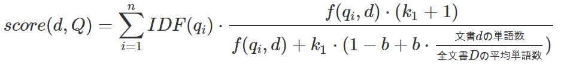
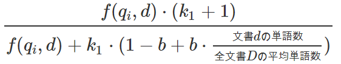
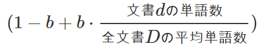
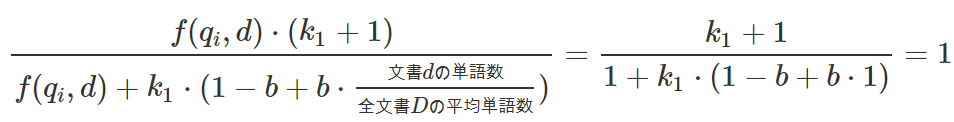

# BM25

* tfidfの改良版であり、情報検索のスコアリング手法の一つ。
* 詳細には、tf部分を改良しており、idfは同じものを用いる。
* tfは、文書内の単語の割合であるが、割合の場合、以下の課題がある。
  * 同一の単語数の文書で、1個の出現と2個の出現の重要性が倍異なる。
  * これがN個となると、N倍異なる。
  * 現実には、１個の出現と２個の出現は1.3倍くらいになってほしいお気持ち。

## 数式

* 文書群の集合をD、クエリをQとし、Qの各単語をq_1, q_2, q_3とすると以下のように定義する。

## 数式の説明

* idfは同じでありであり、シグマの部分はクエリQの各単語の和であるためいったん置いておくと以下のようになる。

* ここでf(q_i,d)は、文書dにおける単語q_iの占める度合であり、様々なパターンがある。
* 例としては以下のようなものである。
  1. tf: term frequency
  2. 単語q_iの数
  3. 単語q_iの数の平方根

* 簡単のため、単語q_iの数とここでは考える。
* 単語数が増えていくに従い、その値はk_1+1に収束する。
  * 分母分子をfで割った式変形をし、極限をとれば分かる。
* このk_1はパラメータであり、1.2～2.0の範囲で設定されることが多い。
* 次に分母の以下に着目する。

* これは処理対象の文書dの単語数に応じて以下の特性を持つ。
  * 全文書の平均単語数と文書dの単語数が同じ: 1となる。
  * 全文書の平均単語数より文書dの単語数が少ない: 1からだんだん小さくなる
  * 全文書の平均単語数より文書dの単語数が多い: 1からだんだん大きくなる

* この式は元式の分母であるため、最終的には以下の特性を持つ。
  * 単語数が多い傾向にある文書: 単語１個あたりの数値が小さくなる
  * 単語数が少ない傾向にある文書: 単語１個あたりの数値が大きくなる

* この単語数の影響はパラメータbによって制御され、b=0.75で使用されることが多い。

* 全文書の平均単語数と文書dの単語数が同じ、かつ単語q_iの数が1の場合、以下のように1となる。

* 上記を基準として制御されると考えればよい。

* なお単語数が多い場合は、これらによらず一定のk_1+1に収束する。

## まとめ

* 単語数の１つに対する重みを制御し、最大でもk_1+1という値に収束するように定式化。
* ここで、k_1はパラメータであり、これで収束値を制御する。
* また文書dの単語数が平均に比べて大きいか小さいかで、単語1つの影響を制御する。
  * 単語数が多い場合は、１単語あたりの重みが小さくなり、少ない場合は大きくなる。
* この影響度合いは、パラメータbで制御される。

## 感想

* tfidfと同様、ベクトル化にも応用はできそう？

## 参考

* [【自然言語処理】BM25 - tf-idfの進化系の実践類似度分析【Elasticsearch への道②】#085 #VRアカデミア - YouTube](https://www.youtube.com/watch?v=_HSOX0oh2ns)
* [Okapi BM25 - Wikipedia](https://ja.wikipedia.org/wiki/Okapi_BM25)