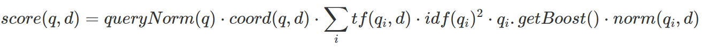
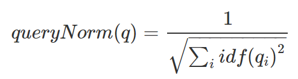
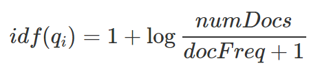
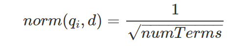

# Lucene's Practical Scoring Function

ElasticSearchがデフォルトで使用している検索アルゴリズム

## 数式

クエリqに対する文書dの関連性スコアとして以下のように与えられる。

## 解説

### queryNorm(q): Query Normalization Factor

queryNormは、クエリ同士の結果を比較可能にするための正規化である。
クエリが長ければ長いほど、スコアの絶対値が大きくなる可能性が高いが、これを正規化する。
式は以下で与えられる。

ただしElasticSearch自身が、異なるクエリの関連性スコアを比較しようとするべきではないと言っている点に注意が必要。

> Even though the intent of the query norm is to make results from different queries comparable, it doesn’t work very well. The only purpose of the relevance _score is to sort the results of the current query in the correct order. You should not try to compare the relevance scores from different queries.

> クエリ規範の意図は異なるクエリからの結果を比較できるようにすることであるにもかかわらず、それはあまりうまく機能しません。関連性スコアの唯一の目的は、現在のクエリの結果を正しい順番に並べ替えることです。異なるクエリの関連性スコアを比較しようとするべきではありません。

### coord(q,d): Query Coordination

クエリの単語のうち、何個が文書dに含まれていたか示す値。
単純にクエリの全単語が含まれている場合は1.0、半分しか含まれてない場合は0.5となる係数。
かなりダイナミックな調整が行われる。

ElasticSearchではこの機能を`"disable_coord": true`とすることで無効化できる。

実際にこれを`disable`とするシーンはほとんどないと考えられるが、同義語を含めて検索する場合など、高度な例では使われる場合がある。

ただしこのケースでも、同義語を検索する機能自体があり、内部的にこの調整を無効化するため、ほとんどのユースケースでユーザーが直接`disable`をすることはない。

### tf(q_i,d): Term Frequency

tfは、q_iという単語が文書dに出現する回数の平方根となる。

回数を重視せず、用語の登場したか否かのみに着目したい場合は、`"index_options": "docs"`としてtfを無効にできる。

### idf(q_i): Inverse Document Frequency

idfは単語の希少度合いを示す値である。以下はElasticSearch公式からの引用。

> andやtheといった一般的な用語はほとんどの文書に出現するため、関連性にはほとんど寄与しない。一方、elasticやhippopotamusといった一般的ではない用語は、最も興味深い文書にズームインするのに役立つ。

以下の式で与えられる。

numDocsは全文書数、docFreqはそのうちq_iが出現した文書数を表す。対数は情報理論における情報量を意味する。

* [情報量の意味と対数関数を使う理由 | 高校数学の美しい物語](https://manabitimes.jp/math/1002)

これを二乗することにより、より希少度合いを強調をしていることも特徴である。

### q_i.getBoost: Query-Time Boosting

あるケースを他のケースより重要視するためのパラメータ。例えばboostを2とするとそのケースのスコアが他のケースと比較して倍に強調される。しかし最終的なスコアがその単純に倍となるわけではなく、内部で正規化と最適化が行われる。

実際のところ、ブースト値は試行錯誤が必要なパラメータである。

ブーストは以下のような場合に使用される。

* 本文よりもタイトルに含まれる場合の方が重要であるため、優先度を調整する場合
* 新しく取得された文書群をより優先して検索する場合

設定したブースト値は最終的には単語レベルのブースト値として、計算に盛り込まれる。またもちろん、「あるケース」として単語単位でブースト値を設定することもできる。

また実際には、ブーストはqueryNormに対しても影響を与え少し複雑な計算が内部で行われる。

### norm(q_i,d): Field-length norm

文書の単語数が多いほど、ある単語が含まれる回数が多くなってしまうため、それを正規化するための項である。式は以下で与えられる。

ここで、numTermsは文書内の単語数である。

このField-length normには、全文検索には重要だが、他のケースではあまり必要ないようである。

またこのField-length normにはメモリを使用してしまうため、不要な場合は無効化することでメモリを節約可能。

また式では、q_iが使われていないが、これはindex-Time Field-Level Boostingのためと思われる。これは推奨されておらず、Query-Time Boostingを使用する方が推奨されている。
(実際の式は分からなかったため調べられていない)

## 参考

* [Lucene’s Practical Scoring Function | Elasticsearch: The Definitive Guide [2.x] | Elastic](https://www.elastic.co/guide/en/elasticsearch/guide/current/practical-scoring-function.html)
  * バージョンが古いため、今Lucene's Practical Scoring Functionがどのような扱いなのかは分からない。
* 