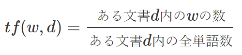
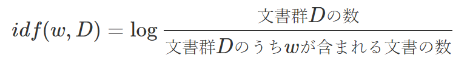
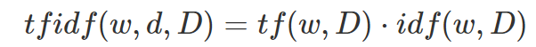
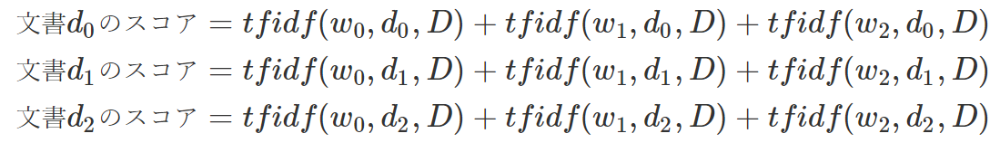
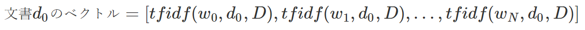

# tf-idf

検索などで用いられる統計量で、コーパス内（文書群）の単語の重要度を表す量。

tfはterm frequencyで、ある文書d内に占めるある単語wの割合となる。



また、idfはinverse document frequencyで、ある文書群Dに単語wが含まれる特異性を考慮した重みである。



これを乗算したものをtf-idfという。(種類は方言が色々あるっぽい)



## 検索の場合

検索する文が、w0, w1, w2で構成され、検索結果を文書群D内で探す。
その場合、w0, w1, w2が含まれる文書を取得するが、その順位付けとして使用される。

具体的には、各文書について以下のように各単語のtf-idfを合計した数値を計算する。



この数値で上位件数を持ってくることで検索を実現する。

これは単純な例だが、ElasticSearchなども基本的にはこの理論を使っているらしい。

ここまではよくある説明だが、これ以降その他の応用用途について述べる。

## TfidfVectorizer

tfidfを使って、各文書d_iを単語の語彙数分の次元を持つベクトルとして表現する。



これに、scikit-learnのTfidfVectorizerを使うことができる。

```python
from sklearn.feature_extraction.text import TfidfVectorizer
corpus = [
    'This is the first document.',
    'This document is the second document.',
    'And this is the third one.',
    'Is this the first document?',
]
vectorizer = TfidfVectorizer()
X = vectorizer.fit_transform(corpus)
vectorizer.get_feature_names_out()
print(X.shape)
# OUT: (4, 9)
```

使用の際に多少の注意点があるようで、デフォルトでは1文字は語彙とはみなされない、大文字が小文字に変換されるなどは考慮に入れておく必要がある。
* [SCDVを使ってハマった話 - Qiita](https://qiita.com/m__k/items/709a9cae184769e2243f)

その他、以下の設定が可能
* max_dfとmin_dfで語彙に含める単語の頻度に上限下限を設定できる。
  * ただし、floatを指定した場合は割合とみなされ、intを指定した場合はcountとみなされるので注意する。
* stop_wordsで語彙とみなさない無視する単語を指定できる。
* max_featuresで最大の語彙数を制御できる
  * ただし、文書群全体の語彙数がそもそもmax_features以下の場合は、文書群全体の語彙数になるので注意する。
  * なので固定長にしてくれるわけではない。

ちなみに、TfidfVectorizerの式は少し定義が異なるので以下を参照すること。
* [Python: scikit-learn と色々な TF-IDF の定義について - CUBE SUGAR CONTAINER](https://blog.amedama.jp/entry/tf-idf)

各次元がどの単語に相当するかは以下の配列で調べられる。

```python
print(vectorizer.get_feature_names_out())
# OUT: ['and' 'document' 'first' 'is' 'one' 'second' 'the' 'third' 'this']
```

また通常戻り値は語彙数分の巨大な行列となるため、sparse行列でreturnされる。

このsparse行列を特徴量として使用するために、SVDなどで一定次元に変換することなども行う。

```python
from sklearn.decomposition import TruncatedSVD

svd = TruncatedSVD(n_components=5, random_state=1234)
vector = svd.fit_transform(X)
print(vector.shape)
# OUT: (4, 4)
# [[ 9.59056779e-01 -1.34538342e-01 -2.49217835e-01  1.38777878e-17]
#  [ 7.97651808e-01 -1.85487178e-01  5.73886836e-01 -1.04083409e-17]
#  [ 4.57050721e-01  8.88334670e-01  4.43413298e-02  2.08166817e-17]
#  [ 9.59056779e-01 -1.34538342e-01 -2.49217835e-01  1.38777878e-17]]
```

これらは実用上は、scikit-learnにおけるPipelineを使用して実現してもよい。

```python
from sklearn.pipeline import Pipeline

pileline_ = Pipeline([
    ('tfidf', TfidfVectorizer()),
    ('svd', TruncatedSVD(n_components=5, random_state=1234)),
])
vector = pileline_.fit_transform(corpus)
```