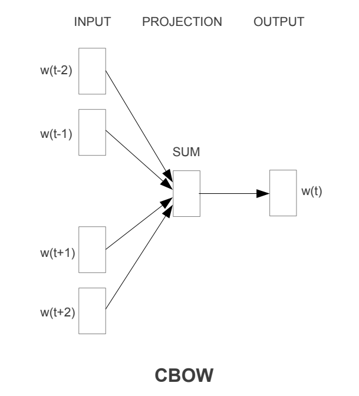
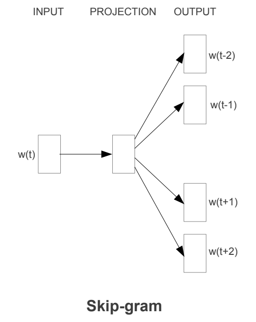

# Word2Vec

* 単語の分散表現を学習する。
  * King - man + woman = Queenになる。 
  * これは単語の意味を数値ベクトルとして表現できている。
* 数値化により演算、比較が可能となる。

## ベクトル化の従来法

* 単語をOne-hot encodingで表現。
  * 語彙数分のベクトル次元が必要(数万～数十万)
* Word2Vecはこれを数十～数百次元に効率化できる。
* またOne-hot encodingの結果を演算することはできない（意味をなさない）。

## 元論文

* [2013.01.16] Efficient Estimation of Word Representations in Vector Space
  * [arxiv](https://arxiv.org/abs/1301.3781)
  * [paperswithcode](https://paperswithcode.com/paper/efficient-estimation-of-word-representations)
* [2013.10.16] Distributed Representations of Words and Phrases and their Compositionality (NeurIPS 2013)
  * [arxiv](https://arxiv.org/abs/1310.4546)
  * [paperswithcode](https://paperswithcode.com/paper/distributed-representations-of-words-and-1)

## アーキテクチャ

* 複数のバージョンがある。(2 x 3通り)
  * モデル構成
    * CBoW, skip-gram
  * 高速化手法
    * なし, hierarchical softmax, negative sampling

* gensimの場合、CBoW + negative samplingとなる。

### CBoW (Continuous Bag-of-Words)

* タスクの内容
  * 前後C個の単語から中央の単語を予測するモデルがCBow。
    * w0, w1, ..., wk, ... wNという単語列がある
    * wk-c, ..., wk+cの単語からwkを予測する。
  * 予測は語彙数Vからどの単語かを選択する。

* CBoWの構成
  * 入力はOne-hotベクトル
    * V次元のベクトルの2C個となる。
  * V次元をh次元に圧縮する行列W(shape=(h,V))を乗算する。
  * その後、2C個のh次元ベクトルを平均する。
  * 平均された1つのh次元ベクトルにV次元に拡大するための行列W'(shape=(V,h))を乗算する。
  * 1つのV次元ベクトルにsoftmax処理し予測値を得る。

* 分散表現の抽出
  * V次元をh次元に圧縮する行列W(shape=(h,V))に着目する。
  * これはOne-hotベクトルに左から乗算することにより任意の単語をh次元のベクトルに圧縮する働きをする。
  * One-hotベクトルに左から乗算することにより、行列Wのある縦列が抽出される。
  * つまり、行列W自体が単語の分散表現になっていると見なせる。

### skip-gram

* タスクの内容
  * CBoWとは逆に、中央の単語から前後C個の単語を予測する
  * CBoWとは異なりタスクは非常に難しいが、最終的にはWを得ることがすることが目的であるため問題ない。

### hierarchical softmax

* 語彙数Vは数十万～数百万であるためsoftmaxの計算が重たい。
  * expの計算を数十万～数百万オーダーで発生する。
* 階層的に分類する
  * 100万分類 = 100分類 x 100分類 x 100分類に階層的に実施する。
  * 2分類で構成する場合、log2(V)回となる。
* ただしこれでも、W'は巨大な行列であることには変わりないため、この行列演算は重たいままである。
* Wも巨大な行列だが、入力がOne-hotであることがわかっているため、演算の必要はなく問題にならない。

### negative sampling

* BoWやskip-gramを学習するうえで、出力段の行列W'はshape=(V,h)である。
* このW'のVの負例について、一部のみを頻度に応じてをサンプリングして使用する。
* それよりロス計算時に少ない分類数に落とし込んで算出することができる。
* より具体的には
  * データセット全体で各単語の出現確率を計算
  * 出現確率を0.75乗して平滑化する
  * 求めた分布で負例をサンプリングする。
  * サンプリングした負例と正例によりロスを計算する。

## なぜ演算可能な分散表現が得られるか

* それにはW'の学習がキモとなっている。
* CBoWの場合、W'は周辺の単語で平均化されたベクトルvと掛け算され、その内積が最も高いものが正解となるように学習される。
* つまりCBoWにおける単語の学習は、以下の特性を持つ。
  * ある単語の周辺単語のベクトル平均が毎回似た方向となるような代表ベクトルを学習する
  * その代表ベクトルは、W'のある行として表現される。
* 平均ベクトルと和のベクトルは方向としては同じである。和が意味を構成するため、その引き算も意味を構成できる。
* 具体的には「King - man + woman = Queen」という式を考える。
  * 前提として以下の例文がある。
    * He is a King.
    * She is a Queen.
    * The King is great.
    * The Queen is great.
    * He is a man.
    * She is a woman.
  * それぞれの単語の意味は周辺により意味付けされるとすると、以下の変形が成り立つ。(実際はその単語の意味付けは全データの周辺単語が関連するので厳密ではない)
    * King - man + woman = Queen
    * ⇔ King + woman = Queen + man
    * ⇔ 「The is great + He is a」+「She is a」=「The is great + She is a」+「He is a」
* またこのロジックから分かる通り以下の注意点がある。
  * 単語単体のベクトルでは意味を構成しない。
    * 周辺の単語を加算(平均)したり、減算することで意味を構成するようにCBoWが学習されている。
  * 演算後のベクトルの絶対値よりその方向が意味を持っている。
    * 演算後の絶対値が大きくても内積は大きくなるが、方向が似ていなければ内積は小さくなる。
  * 語順を考慮したベクトルではない。
    * 周囲の和でその単語の意味らしさを獲得するため、順番を考慮できているわけではない。

## 参考

- [【深層学習】word2vec - 単語の意味を機械が理解する仕組み【ディープラーニングの世界 vol. 21】#089 #VRアカデミア #DeepLearning - YouTube](https://www.youtube.com/watch?v=0CXCqxQAKKQ)
- [【深層学習】word2vec の数理 - なぜ単語の計算が可能なのか【ディープラーニングの世界 vol. 22】#090 #VRアカデミア #DeepLearning - YouTube](https://www.youtube.com/watch?v=jlmt4nY0-o0)
- [Negative Samplingの復習 - 機械学習・自然言語処理の勉強メモ](https://kento1109.hatenablog.com/entry/2019/11/29/111028)